# Web Bot Detection with Multiple Classifiers

This project focuses on detecting bots on web traffic by extracting session-level features from web log files and using various machine learning algorithms for classification. The project involves data preprocessing, feature extraction, normalization, model training, evaluation, and visualization. Additionally, several graphs are generated to illustrate model performance and feature distributions.

---

## Project Overview

The goal is to differentiate between human and bot sessions using features extracted from web log files. The project utilizes logs from both human and bot sessions along with corresponding annotations to train multiple classifiers including:
- **SVM (Support Vector Machine)**
- **Random Forest**
- **Logistic Regression**
- **K-Nearest Neighbors (KNN)**

---

## Input Files

- **Log Files:**  
  The dataset includes multiple log files:
  - Bot log file: `access_moderate_bots.log`
  - Human log files: `access_1.log`, `access_2.log`, `access_3.log`, `access_4.log`, and `access_5.log`
  
  Each log line is in Apache-style format with the following fields:
  - Timestamp
  - HTTP Method (e.g., GET, POST)
  - Requested URL
  - HTTP Version and Status Code
  - Bytes served
  - Referer
  - Session ID
  - User-Agent

- **Annotation Files:**  
  Two annotation files (for training and testing) provide the ground-truth labels (e.g., `human`, `moderate_bot`) for each session ID.

---

## Extracted Features

The feature extraction process computes several metrics per session:

### 1. Basic Features
- **Total Requests:** Number of requests in a session.
- **Total Bytes:** Sum of bytes served during the session.
- **GET / POST Counts:** Number of GET and POST requests.
- **HTTP 3xx Responses:** Count of redirection responses.
- **HTTP 4xx Responses:** Count of client error responses.
- **Image Requests Percent:** Percentage of requests targeting images.

### 2. New Features
- **HTML-to-Image Ratio:** Ratio of HTML page requests (non-static resources) to image requests.  
  _Importance:_ Differentiates sessions that heavily request static images versus those browsing HTML pages.
- **Depth Standard Deviation:** Standard deviation of URL path depths within a session.  
  _Importance:_ Reflects how diverse the accessed pages are within the session.
- **Max Requests Per Page:** The maximum number of requests made to a single page.  
  _Importance:_ Indicates whether a user repeatedly accesses a specific page, which may signal automated behavior.

### 3. Timing-Based Features
- **Sequential Request Percentage:** Percentage of consecutive requests with inter-arrival times below a threshold (e.g., 2 seconds).  
  _Importance:_ High sequential percentages may indicate automated browsing.
- **Browsing Speed:** Number of requests per second (total requests divided by session duration).  
  _Importance:_ Faster browsing speed is often associated with bots.
- **Session Duration:** Total duration of a session in seconds (difference between first and last request).  
  _Importance:_ Short sessions with many requests might be suspicious.
- **Inter-Request Timing:** Average time between consecutive requests.  
  _Importance:_ Short average inter-request times suggest bot-like behavior.

---

## Evaluation Metrics

After feature extraction and normalization, multiple classifiers are trained and evaluated using:
- **Accuracy:** Overall percentage of correctly classified sessions.
- **Precision:** Fraction of sessions predicted as bots that are truly bots.
- **Recall:** Fraction of actual bot sessions that were correctly identified.
- **F1 Score:** Harmonic mean of precision and recall, useful for imbalanced datasets.
- **Confusion Matrix:** Provides detailed counts of true positives, true negatives, false positives, and false negatives.
- **ROC Curve & AUC:** Visualizes the trade-off between true positive rate and false positive rate and summarizes performance via the Area Under the Curve.

---

## Graphs and Visualizations

The project generates several graphs to aid in analysis and presentations:

1. **Training Distribution:**  
   _Illustration:_ A bar chart showing the number of human vs. bot sessions.  
   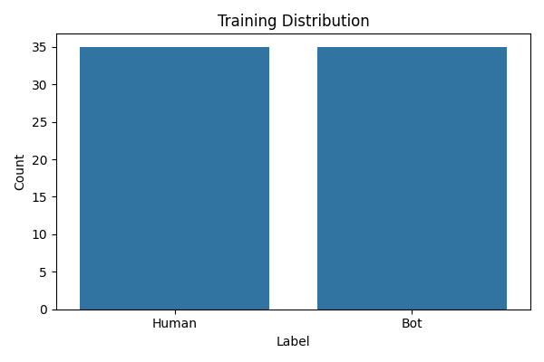

2. **Feature Correlation Heatmap:**  
   _Illustration:_ A heatmap showing correlations among features, which helps identify influential metrics.  
   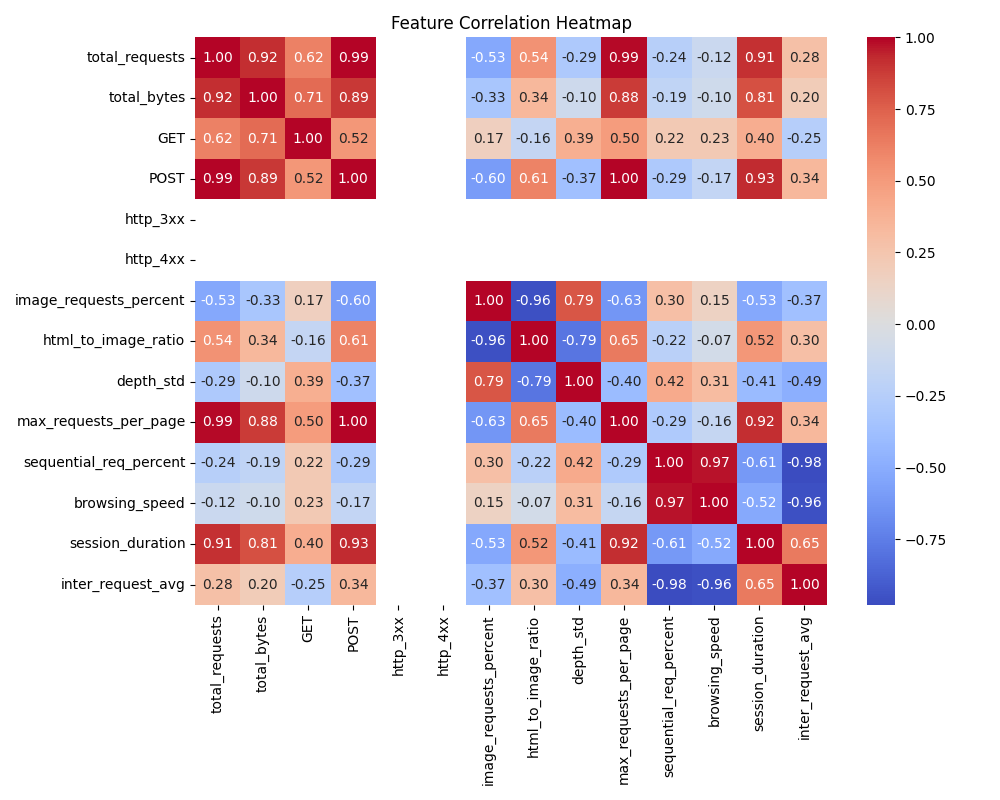

3. **Confusion Matrices:**  
   _Illustration:_ Confusion matrices for each classifier detailing classification performance.  
   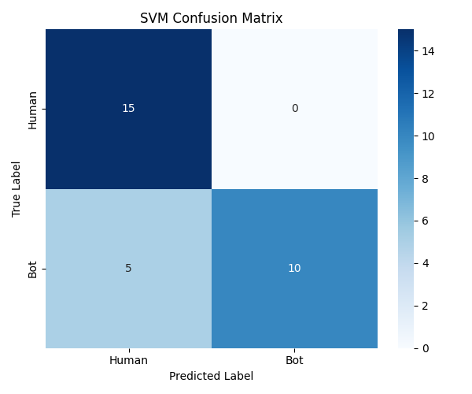  
   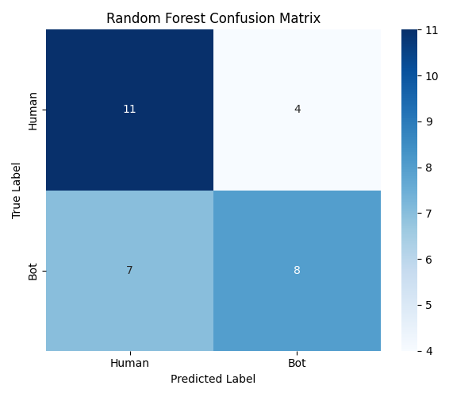
  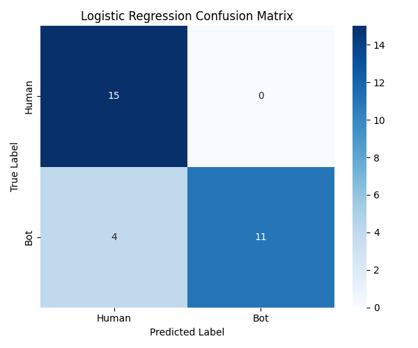
    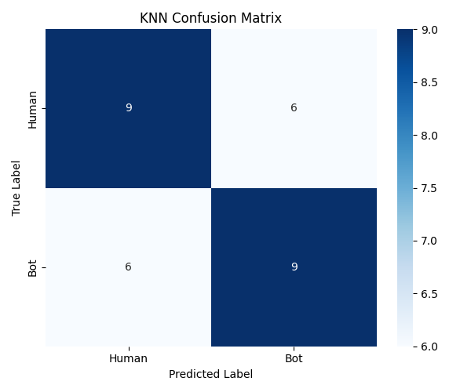

4. **Classifier Performance Comparison:**  
   _Illustration:_ A bar chart comparing accuracy, precision, recall, and F1 score across classifiers.  
   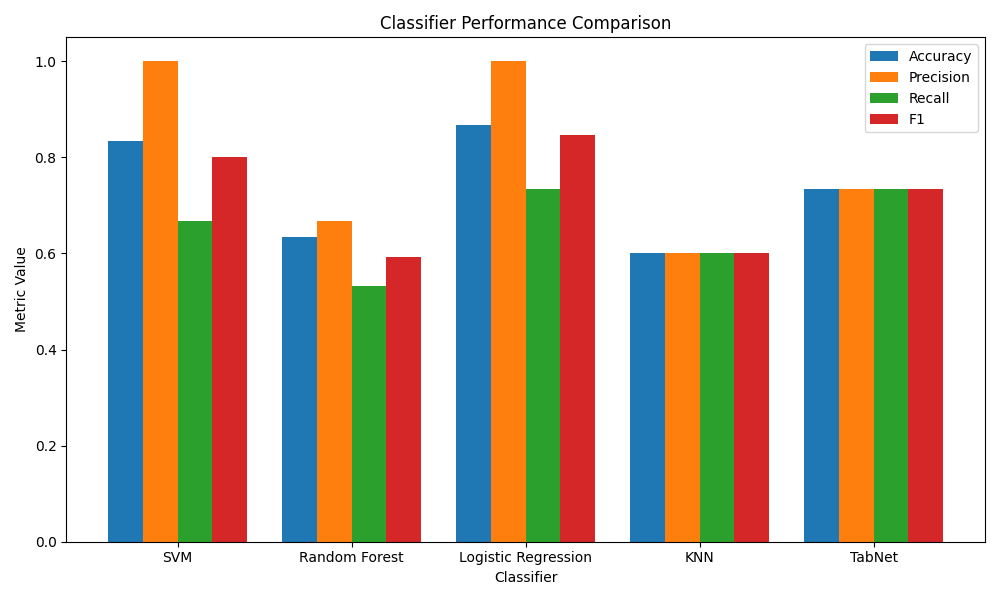

<!-- 5. **ROC Curve Comparison:**  
   _Illustration:_ ROC curves (with AUC) for classifiers supporting probability estimates.  
   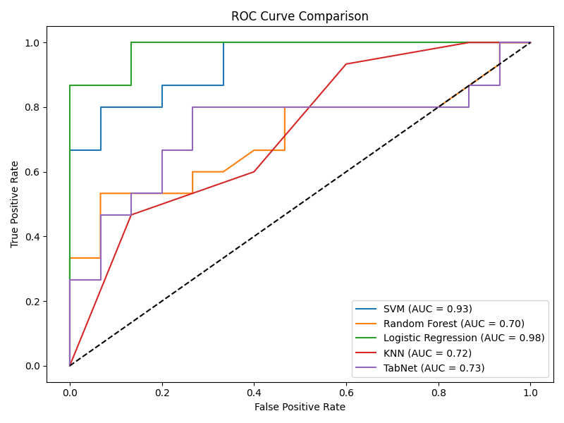 -->

5. **Feature Distributions:**  
   _Illustration:_ Histograms (with KDE plots) for key features such as total requests, session duration, browsing speed, and inter-request timing.  
   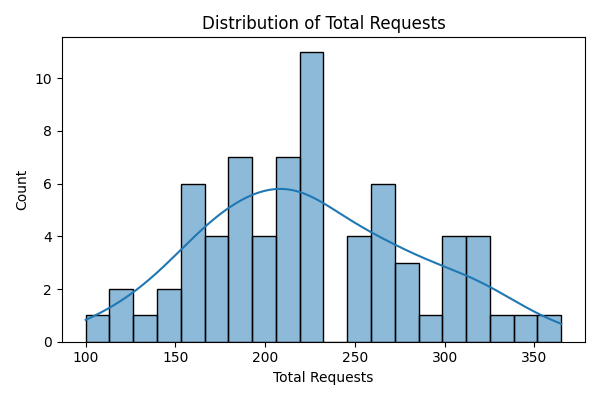  
   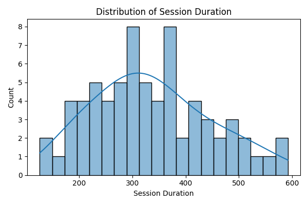

6. **Scatter Plot:**  
   _Illustration:_ A scatter plot of session duration vs. browsing speed, color-coded by label.  
   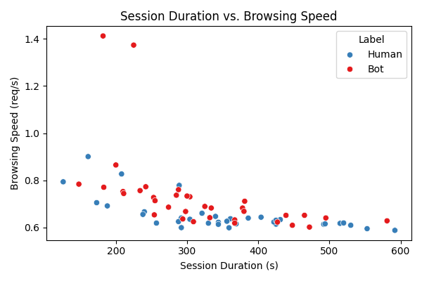

---

## How to Run

1. **Pre-requisites:**  
   - Python 3.x  
   - Libraries: `numpy`, `pandas`, `matplotlib`, `seaborn`, `scikit-learn`

2. **Steps:**
   - Place the log and annotation files in the specified directories.
   - Run the provided Python script.
   - The script outputs performance metrics to the console and saves all generated graphs as PNG files.

---

## Conclusion

This project provides a comprehensive approach to web bot detection using session-level features from web log files. The combination of multiple classifiers, detailed evaluation metrics, and extensive visualizations makes it an ideal tool for demonstrating the efficacy of bot detection strategies in meetings or presentations.

---

